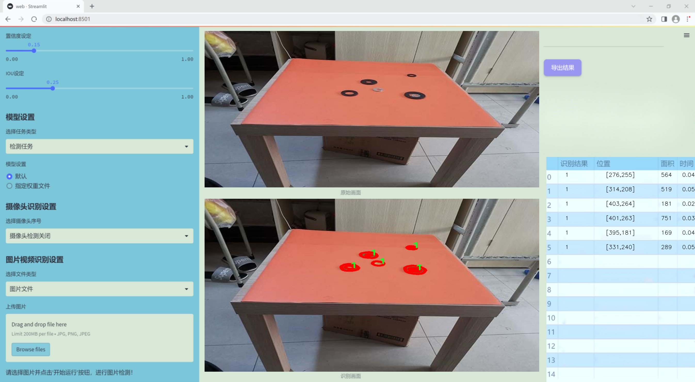
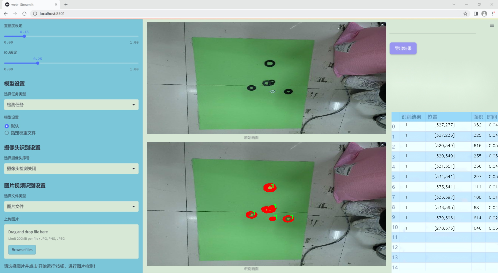
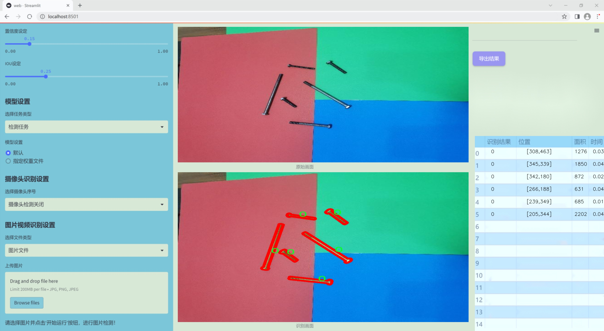
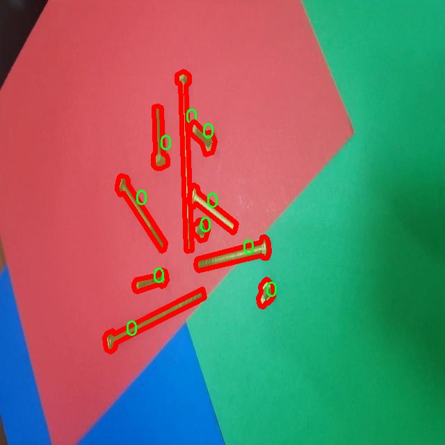
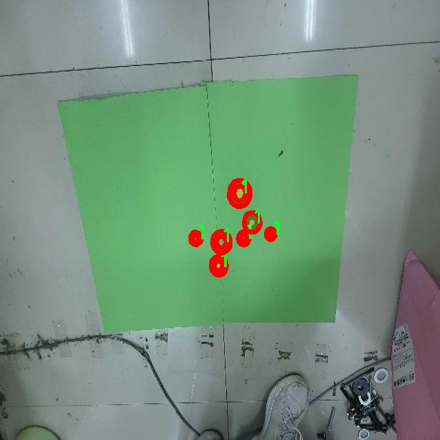
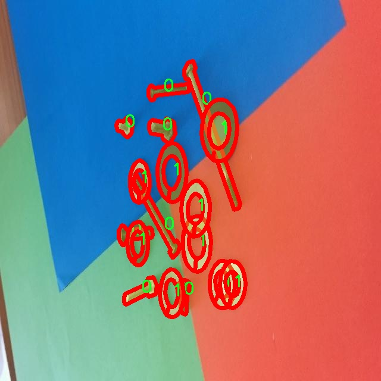
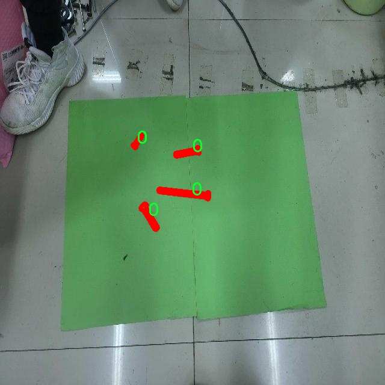

### 1.背景意义

研究背景与意义

随着工业自动化和智能制造的迅速发展，零件的高效识别与分割在生产线上的重要性日益凸显。传统的图像处理方法在处理复杂场景时往往面临着准确性不足和实时性差的问题，而深度学习技术的引入为这一领域带来了新的机遇。特别是基于卷积神经网络（CNN）的实例分割技术，能够对图像中的每一个目标进行精确的像素级别分割，极大地提升了零件识别的精度和效率。

本研究旨在基于改进的YOLOv11模型，构建一个高效的零件实例分割系统。YOLO（You Only Look Once）系列模型以其快速的推理速度和良好的检测精度而受到广泛关注。通过对YOLOv11进行改进，我们希望能够在保持实时性能的同时，进一步提升模型在复杂背景下的分割精度。此外，所使用的数据集包含1600张图像，涵盖了两个类别的零件实例，为模型的训练和验证提供了丰富的样本支持。

在实际应用中，零件实例分割系统不仅可以提高生产效率，还能降低人工干预的需求，减少人为错误的发生。通过对零件进行自动化识别和分割，企业能够实现更高的生产灵活性和资源利用率，进而提升整体竞争力。因此，研究基于改进YOLOv11的零件实例分割系统，不仅具有重要的学术价值，也对实际工业应用具有深远的意义。通过这一研究，我们期望为智能制造领域的图像处理技术提供新的思路和解决方案，推动行业的技术进步与创新发展。

### 2.视频效果

[2.1 视频效果](https://www.bilibili.com/video/BV1uMq5YsEWV/)

### 3.图片效果







##### [项目涉及的源码数据来源链接](https://kdocs.cn/l/cszuIiCKVNis)**

注意：本项目提供训练的数据集和训练教程,由于版本持续更新,暂不提供权重文件（best.pt）,请按照6.训练教程进行训练后实现上图演示的效果。

### 4.数据集信息

##### 4.1 本项目数据集类别数＆类别名

nc: 2
names: ['0', '1']


该项目为【图像分割】数据集，请在【训练教程和Web端加载模型教程（第三步）】这一步的时候按照【图像分割】部分的教程来训练

##### 4.2 本项目数据集信息介绍

本项目数据集信息介绍

本项目所使用的数据集旨在支持改进YOLOv11的零件实例分割系统，特别聚焦于“2d-segnew”主题。该数据集包含了丰富的图像数据，专门设计用于训练和评估深度学习模型在零件实例分割任务中的表现。数据集中包含两个主要类别，分别标记为“0”和“1”，这两个类别的选择旨在涵盖特定的应用场景，以确保模型能够在实际应用中有效识别和分割不同类型的零件。

数据集的构建过程遵循严格的标准，确保每个类别的样本数量和质量都能满足训练需求。每个图像都经过精确标注，确保模型在学习过程中能够获得准确的反馈。这种高质量的标注不仅提升了模型的学习效率，也为后续的验证和测试提供了可靠的基础。此外，数据集中的图像多样性涵盖了不同的拍摄角度、光照条件和背景环境，以增强模型的泛化能力，使其能够在各种实际应用场景中表现出色。

在训练过程中，改进YOLOv11将利用该数据集进行端到端的学习，通过不断优化模型参数，提升其在零件实例分割任务中的准确性和效率。数据集的设计理念不仅关注模型的性能提升，也考虑到实际应用中的可操作性和适应性，确保最终的系统能够在工业生产、自动化检测等领域发挥重要作用。通过对该数据集的深入分析和应用，我们期望能够推动零件实例分割技术的发展，为相关行业带来更高的智能化水平和生产效率。










### 5.全套项目环境部署视频教程（零基础手把手教学）

[5.1 所需软件PyCharm和Anaconda安装教程（第一步）](https://www.bilibili.com/video/BV1BoC1YCEKi/?spm_id_from=333.999.0.0&vd_source=bc9aec86d164b67a7004b996143742dc)


[5.2 安装Python虚拟环境创建和依赖库安装视频教程（第二步）](https://www.bilibili.com/video/BV1ZoC1YCEBw?spm_id_from=333.788.videopod.sections&vd_source=bc9aec86d164b67a7004b996143742dc)

### 6.改进YOLOv11训练教程和Web_UI前端加载模型教程（零基础手把手教学）

[6.1 改进YOLOv11训练教程和Web_UI前端加载模型教程（第三步）](https://www.bilibili.com/video/BV1BoC1YCEhR?spm_id_from=333.788.videopod.sections&vd_source=bc9aec86d164b67a7004b996143742dc)


按照上面的训练视频教程链接加载项目提供的数据集，运行train.py即可开始训练



     Epoch   gpu_mem       box       obj       cls    labels  img_size
     1/200     20.8G   0.01576   0.01955  0.007536        22      1280: 100%|██████████| 849/849 [14:42<00:00,  1.04s/it]
               Class     Images     Labels          P          R     mAP@.5 mAP@.5:.95: 100%|██████████| 213/213 [01:14<00:00,  2.87it/s]
                 all       3395      17314      0.994      0.957      0.0957      0.0843

     Epoch   gpu_mem       box       obj       cls    labels  img_size
     2/200     20.8G   0.01578   0.01923  0.007006        22      1280: 100%|██████████| 849/849 [14:44<00:00,  1.04s/it]
               Class     Images     Labels          P          R     mAP@.5 mAP@.5:.95: 100%|██████████| 213/213 [01:12<00:00,  2.95it/s]
                 all       3395      17314      0.996      0.956      0.0957      0.0845

     Epoch   gpu_mem       box       obj       cls    labels  img_size
     3/200     20.8G   0.01561    0.0191  0.006895        27      1280: 100%|██████████| 849/849 [10:56<00:00,  1.29it/s]
               Class     Images     Labels          P          R     mAP@.5 mAP@.5:.95: 100%|███████   | 187/213 [00:52<00:00,  4.04it/s]
                 all       3395      17314      0.996      0.957      0.0957      0.0845


###### [项目数据集下载链接](https://kdocs.cn/l/cszuIiCKVNis)

### 7.原始YOLOv11算法讲解


##### YOLOv11三大损失函数

YOLOv11（You Only Look Once）是一种流行的目标检测算法，其损失函数设计用于同时优化分类和定位任务。YOLO的损失函数通常包括几个部分：
**分类损失、定位损失（边界框回归损失）和置信度损失** 。其中，

  1. box_loss（边界框回归损失）是用于优化预测边界框与真实边界框之间的差异的部分。

  2. cls_loss（分类损失）是用于优化模型对目标类别的预测准确性的部分。分类损失确保模型能够正确地识别出图像中的对象属于哪个类别。

  3. dfl_loss（Distribution Focal Loss）是YOLO系列中的一种损失函数，特别是在一些改进版本如YOLOv5和YOLOv7中被引入。它的主要目的是解决目标检测中的类别不平衡问题，并提高模型在处理小目标和困难样本时的性能。

##### 边界框回归损失详解

box_loss（边界框回归损失）是用于优化预测边界框与真实边界框之间的差异的部分。


##### box_loss 的具体意义


##### 为什么需要 box_loss

  * 精确定位：通过最小化中心点坐标损失和宽高损失，模型能够更准确地预测目标的位置和大小。
  * 平衡不同类型的目标：使用平方根来处理宽高损失，可以更好地平衡不同大小的目标，确保小目标也能得到足够的关注。
  * 稳定训练：适当的损失函数设计有助于模型的稳定训练，避免梯度爆炸或消失等问题。

##### 分类损失详解

在YOLO（You Only Look
Once）目标检测算法中，cls_loss（分类损失）是用于优化模型对目标类别的预测准确性的部分。分类损失确保模型能够正确地识别出图像中的对象属于哪个类别。下面是关于cls_loss的详细解读：

##### 分类损失 (cls_loss) 的具体意义

  
分类损失通常使用交叉熵损失（Cross-Entropy
Loss）来计算。交叉熵损失衡量的是模型预测的概率分布与真实标签之间的差异。在YOLO中，分类损失的具体形式如下：


##### 为什么需要 cls_loss

  * 类别识别：cls_loss 确保模型能够正确识别出图像中的目标属于哪个类别。这对于目标检测任务至关重要，因为不仅需要知道目标的位置，还需要知道目标的类型。

  * 多类别支持：通过最小化分类损失，模型可以处理多个类别的目标检测任务。例如，在道路缺陷检测中，可能需要识别裂缝、坑洞、路面破损等多种类型的缺陷。

  * 提高准确性：分类损失有助于提高模型的分类准确性，从而提升整体检测性能。通过优化分类损失，模型可以更好地学习不同类别之间的特征差异。

##### 分布损失详解

`dfl_loss`（Distribution Focal
Loss）是YOLO系列中的一种损失函数，特别是在一些改进版本如YOLOv5和YOLOv7中被引入。它的主要目的是解决目标检测中的类别不平衡问题，并提高模型在处理小目标和困难样本时的性能。下面是对`dfl_loss`的详细解读：

##### DFL Loss 的背景

在目标检测任务中，类别不平衡是一个常见的问题。某些类别的样本数量可能远远多于其他类别，这会导致模型在训练过程中对常见类别的学习效果较好，而对罕见类别的学习效果较差。此外，小目标和困难样本的检测也是一个挑战，因为这些目标通常具有较少的特征信息，容易被忽略或误分类。

为了应对这些问题，研究者们提出了多种改进方法，其中之一就是`dfl_loss`。`dfl_loss`通过引入分布焦点损失来增强模型对困难样本的关注，并改善类别不平衡问题。

##### DFL Loss 的定义

DFL Loss
通常与传统的交叉熵损失结合使用，以增强模型对困难样本的学习能力。其核心思想是通过对每个类别的预测概率进行加权，使得模型更加关注那些难以正确分类的样本。

DFL Loss 的公式可以表示为：


##### DFL Loss 的具体意义**

  * **类别不平衡：** 通过引入平衡因子 α，DFL Loss 可以更好地处理类别不平衡问题。对于少数类别的样本，可以通过增加其权重来提升其重要性，从而提高模型对这些类别的检测性能。
  *  **困难样本：** 通过聚焦参数 γ，DFL Loss 可以让模型更加关注那些难以正确分类的样本。当 
  * γ 较大时，模型会对那些预测概率较低的样本给予更多的关注，从而提高这些样本的分类准确性。
  *  **提高整体性能** ：DFL Loss 结合了传统交叉熵损失的优势，并通过加权机制增强了模型对困难样本的学习能力，从而提高了整体的检测性能。


### 8.200+种全套改进YOLOV11创新点原理讲解

#### 8.1 200+种全套改进YOLOV11创新点原理讲解大全

由于篇幅限制，每个创新点的具体原理讲解就不全部展开，具体见下列网址中的改进模块对应项目的技术原理博客网址【Blog】（创新点均为模块化搭建，原理适配YOLOv5~YOLOv11等各种版本）

[改进模块技术原理博客【Blog】网址链接](https://gitee.com/qunmasj/good)


#### 8.2 精选部分改进YOLOV11创新点原理讲解

###### 这里节选部分改进创新点展开原理讲解(完整的改进原理见上图和[改进模块技术原理博客链接](https://gitee.com/qunmasj/good)【如果此小节的图加载失败可以通过CSDN或者Github搜索该博客的标题访问原始博客，原始博客图片显示正常】

### RCS-OSA的基本原理
参考该博客，RCSOSA（RCS-One-Shot Aggregation）是RCS-YOLO中提出的一种结构，我们可以将主要原理概括如下：

1. RCS（Reparameterized Convolution based on channel Shuffle）: 结合了通道混洗，通过重参数化卷积来增强网络的特征提取能力。

2. RCS模块: 在训练阶段，利用多分支结构学习丰富的特征表示；在推理阶段，通过结构化重参数化简化为单一分支，减少内存消耗。

3. OSA（One-Shot Aggregation）: 一次性聚合多个特征级联，减少网络计算负担，提高计算效率。

4. 特征级联: RCS-OSA模块通过堆叠RCS，确保特征的复用并加强不同层之间的信息流动。

#### RCS
RCS（基于通道Shuffle的重参数化卷积）是RCS-YOLO的核心组成部分，旨在训练阶段通过多分支结构学习丰富的特征信息，并在推理阶段通过简化为单分支结构来减少内存消耗，实现快速推理。此外，RCS利用通道分割和通道Shuffle操作来降低计算复杂性，同时保持通道间的信息交换，这样在推理阶段相比普通的3×3卷积可以减少一半的计算复杂度。通过结构重参数化，RCS能够在训练阶段从输入特征中学习深层表示，并在推理阶段实现快速推理，同时减少内存消耗。

#### RCS模块
RCS（基于通道Shuffle的重参数化卷积）模块中，结构在训练阶段使用多个分支，包括1x1和3x3的卷积，以及一个直接的连接（Identity），用于学习丰富的特征表示。在推理阶段，结构被重参数化成一个单一的3x3卷积，以减少计算复杂性和内存消耗，同时保持训练阶段学到的特征表达能力。这与RCS的设计理念紧密相连，即在不牺牲性能的情况下提高计算效率。


上图为大家展示了RCS的结构，分为训练阶段（a部分）和推理阶段（b部分）。在训练阶段，输入通过通道分割，一部分输入经过RepVGG块，另一部分保持不变。然后通过1x1卷积和3x3卷积处理RepVGG块的输出，与另一部分输入进行通道Shuffle和连接。在推理阶段，原来的多分支结构被简化为一个单一的3x3 RepConv块。这种设计允许在训练时学习复杂特征，在推理时减少计算复杂度。黑色边框的矩形代表特定的模块操作，渐变色的矩形代表张量的特定特征，矩形的宽度代表张量的通道数。 

#### OSA
OSA（One-Shot Aggregation）是一个关键的模块，旨在提高网络在处理密集连接时的效率。OSA模块通过表示具有多个感受野的多样化特征，并在最后的特征映射中仅聚合一次所有特征，从而克服了DenseNet中密集连接的低效率问题。

OSA模块的使用有两个主要目的：

1. 提高特征表示的多样性：OSA通过聚合具有不同感受野的特征来增加网络对于不同尺度的敏感性，这有助于提升模型对不同大小目标的检测能力。

2. 提高效率：通过在网络的最后一部分只进行一次特征聚合，OSA减少了重复的特征计算和存储需求，从而提高了网络的计算和能源效率。

在RCS-YOLO中，OSA模块被进一步与RCS（基于通道Shuffle的重参数化卷积）相结合，形成RCS-OSA模块。这种结合不仅保持了低成本的内存消耗，而且还实现了语义信息的有效提取，对于构建轻量级和大规模的对象检测器尤为重要。

下面我将为大家展示RCS-OSA（One-Shot Aggregation of RCS）的结构。


在RCS-OSA模块中，输入被分为两部分，一部分直接通过，另一部分通过堆叠的RCS模块进行处理。处理后的特征和直接通过的特征在通道混洗（Channel Shuffle）后合并。这种结构设计用于增强模型的特征提取和利用效率，是RCS-YOLO架构中的一个关键组成部分旨在通过一次性聚合来提高模型处理特征的能力，同时保持计算效率。

#### 特征级联
特征级联（feature cascade）是一种技术，通过在网络的一次性聚合（one-shot aggregate）路径上维持有限数量的特征级联来实现的。在RCS-YOLO中，特别是在RCS-OSA（RCS-Based One-Shot Aggregation）模块中，只保留了三个特征级联。

特征级联的目的是为了减轻网络计算负担并降低内存占用。这种方法可以有效地聚合不同层次的特征，提高模型的语义信息提取能力，同时避免了过度复杂化网络结构所带来的低效率和高资源消耗。

下面为大家提供的图像展示的是RCS-YOLO的整体架构，其中包括RCS-OSA模块。RCS-OSA在模型中用于堆叠RCS模块，以确保特征的复用并加强不同层之间的信息流动。图中显示的多层RCS-OSA模块的排列和组合反映了它们如何一起工作以优化特征传递和提高检测性能。


总结：RCS-YOLO主要由RCS-OSA（蓝色模块）和RepVGG（橙色模块）构成。这里的n代表堆叠RCS模块的数量。n_cls代表检测到的对象中的类别数量。图中的IDetect是从YOLOv11中借鉴过来的，表示使用二维卷积神经网络的检测层。这个架构通过堆叠的RCS模块和RepVGG模块，以及两种类型的检测层，实现了对象检测的任务。 


### 9.系统功能展示

图9.1.系统支持检测结果表格显示

  图9.2.系统支持置信度和IOU阈值手动调节

  图9.3.系统支持自定义加载权重文件best.pt(需要你通过步骤5中训练获得)

  图9.4.系统支持摄像头实时识别

  图9.5.系统支持图片识别

  图9.6.系统支持视频识别

  图9.7.系统支持识别结果文件自动保存

  图9.8.系统支持Excel导出检测结果数据


### 10. YOLOv11核心改进源码讲解

#### 10.1 test_selective_scan_speed.py

以下是对您提供的代码进行的逐文件分析，保留了最核心的部分，并添加了详细的中文注释：

```python
import torch
import torch.nn.functional as F
from einops import rearrange

def build_selective_scan_fn(selective_scan_cuda: object = None, mode="mamba_ssm", tag=None):
    """
    构建选择性扫描函数的工厂函数，返回一个自定义的前向和反向传播函数。
    """
    MODE = mode

    class SelectiveScanFn(torch.autograd.Function):
        @staticmethod
        def forward(ctx, u, delta, A, B, C, D=None, z=None, delta_bias=None, delta_softplus=False, return_last_state=False, nrows=1, backnrows=-1):
            """
            前向传播函数，计算选择性扫描的输出。
            """
            # 确保输入张量是连续的
            u = u.contiguous() if u.stride(-1) != 1 else u
            delta = delta.contiguous() if delta.stride(-1) != 1 else delta
            B = B.contiguous() if B.stride(-1) != 1 else B
            C = C.contiguous() if C.stride(-1) != 1 else C
            if D is not None:
                D = D.contiguous()
            if z is not None and z.stride(-1) != 1:
                z = z.contiguous()

            # 处理输入的维度
            if B.dim() == 3:
                B = rearrange(B, "b dstate l -> b 1 dstate l")
                ctx.squeeze_B = True
            if C.dim() == 3:
                C = rearrange(C, "b dstate l -> b 1 dstate l")
                ctx.squeeze_C = True

            # 检查输入的形状和类型
            assert u.shape[1] % (B.shape[1] * nrows) == 0 
            assert nrows in [1, 2, 3, 4]

            # 选择不同的计算模式
            if MODE == "mamba_ssm":
                out, x, *rest = selective_scan_cuda.fwd(u, delta, A, B, C, D, z, delta_bias, delta_softplus)
            else:
                raise NotImplementedError

            ctx.delta_softplus = delta_softplus
            ctx.has_z = z is not None

            last_state = x[:, :, -1, 1::2]  # 获取最后一个状态
            ctx.save_for_backward(u, delta, A, B, C, D, delta_bias, x)
            return out if not return_last_state else (out, last_state)

        @staticmethod
        def backward(ctx, dout):
            """
            反向传播函数，计算梯度。
            """
            u, delta, A, B, C, D, delta_bias, x = ctx.saved_tensors
            dout = dout.contiguous() if dout.stride(-1) != 1 else dout

            # 计算梯度
            du, ddelta, dA, dB, dC, dD, ddelta_bias, *rest = selective_scan_cuda.bwd(
                u, delta, A, B, C, D, delta_bias, dout, x, ctx.delta_softplus
            )

            # 返回梯度
            return (du, ddelta, dA, dB, dC, dD if D is not None else None, None, ddelta_bias if delta_bias is not None else None)

    def selective_scan_fn(u, delta, A, B, C, D=None, z=None, delta_bias=None, delta_softplus=False, return_last_state=False, nrows=1, backnrows=-1):
        """
        封装选择性扫描函数的调用。
        """
        return SelectiveScanFn.apply(u, delta, A, B, C, D, z, delta_bias, delta_softplus, return_last_state, nrows, backnrows)

    return selective_scan_fn

def selective_scan_ref(u, delta, A, B, C, D=None, z=None, delta_bias=None, delta_softplus=False, return_last_state=False):
    """
    参考实现的选择性扫描函数，主要用于验证。
    """
    dtype_in = u.dtype
    u = u.float()
    delta = delta.float()
    if delta_bias is not None:
        delta = delta + delta_bias[..., None].float()
    if delta_softplus:
        delta = F.softplus(delta)

    batch, dim, dstate = u.shape[0], A.shape[0], A.shape[1]
    x = A.new_zeros((batch, dim, dstate))
    ys = []
    deltaA = torch.exp(torch.einsum('bdl,dn->bdln', delta, A))

    for i in range(u.shape[2]):
        x = deltaA[:, :, i] * x + deltaB_u[:, :, i]
        y = torch.einsum('bdn,dn->bd', x, C)
        ys.append(y)

    y = torch.stack(ys, dim=2)  # (batch dim L)
    out = y if D is None else y + u * rearrange(D, "d -> d 1")
    if z is not None:
        out = out * F.silu(z)
    out = out.to(dtype=dtype_in)
    return out if not return_last_state else (out, last_state)

# 其他辅助函数和测试函数省略
```

### 代码核心部分说明：
1. **选择性扫描函数构建**：`build_selective_scan_fn` 函数用于创建一个选择性扫描的自定义函数。该函数使用 PyTorch 的自动求导机制，定义了前向和反向传播的计算逻辑。

2. **前向传播**：在 `forward` 方法中，首先确保输入张量是连续的，然后根据不同的模式调用 CUDA 实现的前向函数，计算输出并保存必要的中间变量以供反向传播使用。

3. **反向传播**：在 `backward` 方法中，使用保存的中间变量计算输入的梯度，并返回这些梯度。

4. **参考实现**：`selective_scan_ref` 提供了选择性扫描的参考实现，主要用于验证 CUDA 实现的正确性。

5. **其他功能**：代码中还包含了一些辅助函数和测试代码，但为了简洁起见，未在此展示。

通过以上分析和注释，您可以更好地理解代码的核心逻辑和实现细节。

这个文件 `test_selective_scan_speed.py` 主要是用于测试和评估选择性扫描（Selective Scan）算法的速度和性能。代码中使用了 PyTorch 库，并且包含了一些自定义的 CUDA 操作，以加速计算过程。以下是对代码的逐步分析和说明。

首先，文件引入了一些必要的库，包括 `torch`、`torch.nn.functional`、`pytest` 等，后者用于测试框架。文件中还定义了一些函数，这些函数主要用于实现选择性扫描的前向和反向传播操作。

`build_selective_scan_fn` 函数用于构建一个选择性扫描的自定义 PyTorch 函数。这个函数内部定义了一个 `SelectiveScanFn` 类，继承自 `torch.autograd.Function`。该类包含了 `forward` 和 `backward` 两个静态方法，分别用于前向传播和反向传播的计算。在 `forward` 方法中，首先对输入数据进行一些预处理，比如确保输入张量是连续的，并且对输入的维度进行了一些检查。接着，根据不同的模式（如 "mamba_ssm"、"sscore" 等），调用相应的 CUDA 函数进行计算。最后，保存计算过程中需要的张量以便在反向传播时使用。

`selective_scan_ref` 函数是选择性扫描的参考实现，主要用于验证 CUDA 实现的正确性。它接受一系列输入张量，并根据选择性扫描的算法逻辑进行计算，输出结果和最后的状态。

`selective_scan_easy` 和 `selective_scan_easy_v2` 函数是选择性扫描的简化实现，分别实现了不同的计算逻辑。它们的输入和输出与 `selective_scan_ref` 类似，但实现方式可能更加简化，适合不同的使用场景。

`test_speed` 函数是整个文件的核心部分，负责测试不同选择性扫描实现的速度。它设置了一些参数，包括数据类型、序列长度、批量大小等，然后生成随机输入数据。接着，它定义了一系列测试函数，分别调用不同的选择性扫描实现，并测量其执行时间。测试结果将输出到控制台，以便用户评估不同实现的性能。

总体而言，这个文件的主要目的是实现选择性扫描算法，并通过不同的实现进行性能比较。通过使用 PyTorch 的自定义操作和 CUDA 加速，代码旨在提高选择性扫描的计算效率，适用于需要处理大量数据的深度学习任务。

#### 10.2 revcol.py

以下是代码中最核心的部分，并附上详细的中文注释：

```python
import torch
import torch.nn as nn

class ReverseFunction(torch.autograd.Function):
    @staticmethod
    def forward(ctx, run_functions, alpha, *args):
        # 提取运行的函数和缩放因子
        l0, l1, l2, l3 = run_functions
        alpha0, alpha1, alpha2, alpha3 = alpha
        
        # 保存上下文信息
        ctx.run_functions = run_functions
        ctx.alpha = alpha
        
        # 断开梯度计算，获取输入张量
        x, c0, c1, c2, c3 = args
        
        # 使用给定的函数和缩放因子进行前向计算
        with torch.no_grad():
            c0 = l0(x, c1) + c0 * alpha0
            c1 = l1(c0, c2) + c1 * alpha1
            c2 = l2(c1, c3) + c2 * alpha2
            c3 = l3(c2, None) + c3 * alpha3
        
        # 保存中间结果以便反向传播使用
        ctx.save_for_backward(x, c0, c1, c2, c3)
        return x, c0, c1, c2, c3

    @staticmethod
    def backward(ctx, *grad_outputs):
        # 从上下文中恢复保存的张量
        x, c0, c1, c2, c3 = ctx.saved_tensors
        l0, l1, l2, l3 = ctx.run_functions
        alpha0, alpha1, alpha2, alpha3 = ctx.alpha
        
        # 提取梯度输出
        gx_right, g0_right, g1_right, g2_right, g3_right = grad_outputs
        
        # 断开梯度计算，准备反向传播
        (x, c0, c1, c2, c3) = detach_and_grad((x, c0, c1, c2, c3))

        # 反向传播计算
        with torch.enable_grad():
            # 计算各层的梯度
            g3_up = g3_right
            g3_left = g3_up * alpha3  # shortcut
            oup3 = l3(c2, None)
            torch.autograd.backward(oup3, g3_up, retain_graph=True)
            c3_left = (1 / alpha3) * (c3 - oup3)  # 特征反转
            
            g2_up = g2_right + c2.grad
            g2_left = g2_up * alpha2  # shortcut
            oup2 = l2(c1, c3_left)
            torch.autograd.backward(oup2, g2_up, retain_graph=True)
            c2_left = (1 / alpha2) * (c2 - oup2)  # 特征反转
            
            g1_up = g1_right + c1.grad
            g1_left = g1_up * alpha1  # shortcut
            oup1 = l1(c0, c2_left)
            torch.autograd.backward(oup1, g1_up, retain_graph=True)
            c1_left = (1 / alpha1) * (c1 - oup1)  # 特征反转
            
            g0_up = g0_right + c0.grad
            g0_left = g0_up * alpha0  # shortcut
            oup0 = l0(x, c1_left)
            torch.autograd.backward(oup0, g0_up, retain_graph=True)

        # 返回各层的梯度
        return None, None, gx_up, g0_left, g1_left, g2_left, g3_left

class SubNet(nn.Module):
    def __init__(self, channels, layers, kernel, first_col, save_memory) -> None:
        super().__init__()
        # 初始化各层的缩放因子
        self.alpha0 = nn.Parameter(torch.ones((1, channels[0], 1, 1)), requires_grad=True)
        self.alpha1 = nn.Parameter(torch.ones((1, channels[1], 1, 1)), requires_grad=True)
        self.alpha2 = nn.Parameter(torch.ones((1, channels[2], 1, 1)), requires_grad=True)
        self.alpha3 = nn.Parameter(torch.ones((1, channels[3], 1, 1)), requires_grad=True)

        # 创建各层
        self.level0 = Level(0, channels, layers, kernel, first_col)
        self.level1 = Level(1, channels, layers, kernel, first_col)
        self.level2 = Level(2, channels, layers, kernel, first_col)
        self.level3 = Level(3, channels, layers, kernel, first_col)

    def forward(self, *args):
        # 根据是否保存内存选择前向传播方式
        if self.save_memory:
            return self._forward_reverse(*args)
        else:
            return self._forward_nonreverse(*args)

class RevCol(nn.Module):
    def __init__(self, kernel='C2f', channels=[32, 64, 96, 128], layers=[2, 3, 6, 3], num_subnet=5, save_memory=True) -> None:
        super().__init__()
        self.num_subnet = num_subnet
        self.channels = channels
        self.layers = layers

        # 初始化输入层
        self.stem = Conv(3, channels[0], k=4, s=4, p=0)

        # 初始化子网络
        for i in range(num_subnet):
            first_col = True if i == 0 else False
            self.add_module(f'subnet{str(i)}', SubNet(channels, layers, kernel, first_col, save_memory=save_memory))

    def forward(self, x):
        # 进行前向传播
        c0, c1, c2, c3 = 0, 0, 0, 0
        x = self.stem(x)        
        for i in range(self.num_subnet):
            c0, c1, c2, c3 = getattr(self, f'subnet{str(i)}')(x, c0, c1, c2, c3)       
        return [c0, c1, c2, c3]
```

### 代码核心部分说明：
1. **ReverseFunction**: 这是一个自定义的反向传播函数，使用 PyTorch 的 `autograd.Function`。它的 `forward` 方法计算前向传播的结果，并保存中间变量以便后续的反向传播使用。`backward` 方法则实现了反向传播的逻辑，计算梯度并返回。

2. **SubNet**: 这个类表示一个子网络，其中包含多个层和缩放因子。根据 `save_memory` 参数，选择不同的前向传播方式。

3. **RevCol**: 这是整个模型的主类，初始化输入层和多个子网络，并实现前向传播的逻辑。

### 注释说明：
注释详细解释了每个方法的功能、输入输出及其在模型中的作用，帮助理解代码的结构和逻辑。

这个程序文件 `revcol.py` 是一个用于实现反向传播和特征融合的深度学习模型的代码，主要基于 PyTorch 框架。代码中定义了多个类和函数，旨在构建一个具有多个子网络的模型，支持在前向传播和反向传播过程中进行特征的反向和融合。

首先，文件导入了必要的 PyTorch 模块，包括 `torch` 和 `torch.nn`，以及一些自定义的模块（如 `Conv`、`C2f`、`C3` 等）。接着，定义了一些辅助函数，例如 `get_gpu_states`、`get_gpu_device`、`set_device_states` 和 `detach_and_grad`，这些函数主要用于管理 GPU 状态和张量的梯度设置。

`ReverseFunction` 类是一个自定义的自动求导函数，包含 `forward` 和 `backward` 两个静态方法。在 `forward` 方法中，执行一系列操作来计算输出，并保存中间结果以供反向传播使用。反向传播过程中，使用了保存的中间结果和梯度信息，进行特征的反向和融合。

`Fusion` 类用于实现特征的融合，具体通过下采样和上采样操作来处理输入特征。`Level` 类则表示网络的一个层级，包含了融合操作和一系列卷积块。`SubNet` 类是一个子网络，包含多个层级和融合操作，并提供了前向传播的两种方式：非反向传播和反向传播。

`RevCol` 类是整个模型的主体，初始化时定义了多个子网络，并通过 `forward` 方法实现了对输入数据的处理。它首先通过一个卷积层（`stem`）处理输入，然后依次通过每个子网络进行特征的提取和融合，最终返回多个特征图。

总的来说，这个程序文件实现了一个复杂的深度学习模型，支持高效的特征提取和融合，适用于需要在训练过程中节省内存的场景。通过反向传播机制，该模型能够有效地更新权重，优化性能。

#### 10.3 fadc.py

以下是代码中最核心的部分，并附上详细的中文注释：

```python
import torch
import torch.nn as nn
import torch.nn.functional as F

class OmniAttention(nn.Module):
    def __init__(self, in_planes, out_planes, kernel_size, groups=1, reduction=0.0625, kernel_num=4, min_channel=16):
        super(OmniAttention, self).__init__()
        # 计算注意力通道数
        attention_channel = max(int(in_planes * reduction), min_channel)
        self.kernel_size = kernel_size
        self.kernel_num = kernel_num
        self.temperature = 1.0  # 温度参数，用于控制注意力的平滑程度

        # 定义平均池化层
        self.avgpool = nn.AdaptiveAvgPool2d(1)
        # 定义全连接层
        self.fc = nn.Conv2d(in_planes, attention_channel, 1, bias=False)
        self.bn = nn.BatchNorm2d(attention_channel)  # 批归一化
        self.relu = nn.ReLU(inplace=True)  # ReLU激活函数

        # 定义通道注意力的全连接层
        self.channel_fc = nn.Conv2d(attention_channel, in_planes, 1, bias=True)
        self.func_channel = self.get_channel_attention  # 设置通道注意力的计算方法

        # 定义滤波器注意力的计算方法
        if in_planes == groups and in_planes == out_planes:  # 深度卷积
            self.func_filter = self.skip
        else:
            self.filter_fc = nn.Conv2d(attention_channel, out_planes, 1, bias=True)
            self.func_filter = self.get_filter_attention

        # 定义空间注意力的计算方法
        if kernel_size == 1:  # 点卷积
            self.func_spatial = self.skip
        else:
            self.spatial_fc = nn.Conv2d(attention_channel, kernel_size * kernel_size, 1, bias=True)
            self.func_spatial = self.get_spatial_attention

        # 定义核注意力的计算方法
        if kernel_num == 1:
            self.func_kernel = self.skip
        else:
            self.kernel_fc = nn.Conv2d(attention_channel, kernel_num, 1, bias=True)
            self.func_kernel = self.get_kernel_attention

        self._initialize_weights()  # 初始化权重

    def _initialize_weights(self):
        # 初始化卷积层和批归一化层的权重
        for m in self.modules():
            if isinstance(m, nn.Conv2d):
                nn.init.kaiming_normal_(m.weight, mode='fan_out', nonlinearity='relu')
                if m.bias is not None:
                    nn.init.constant_(m.bias, 0)
            if isinstance(m, nn.BatchNorm2d):
                nn.init.constant_(m.weight, 1)
                nn.init.constant_(m.bias, 0)

    def get_channel_attention(self, x):
        # 计算通道注意力
        channel_attention = torch.sigmoid(self.channel_fc(x).view(x.size(0), -1, 1, 1) / self.temperature)
        return channel_attention

    def get_filter_attention(self, x):
        # 计算滤波器注意力
        filter_attention = torch.sigmoid(self.filter_fc(x).view(x.size(0), -1, 1, 1) / self.temperature)
        return filter_attention

    def get_spatial_attention(self, x):
        # 计算空间注意力
        spatial_attention = self.spatial_fc(x).view(x.size(0), 1, 1, 1, self.kernel_size, self.kernel_size)
        spatial_attention = torch.sigmoid(spatial_attention / self.temperature)
        return spatial_attention

    def get_kernel_attention(self, x):
        # 计算核注意力
        kernel_attention = self.kernel_fc(x).view(x.size(0), -1, 1, 1, 1, 1)
        kernel_attention = F.softmax(kernel_attention / self.temperature, dim=1)
        return kernel_attention

    def forward(self, x):
        # 前向传播
        x = self.avgpool(x)  # 平均池化
        x = self.fc(x)  # 全连接层
        x = self.bn(x)  # 批归一化
        x = self.relu(x)  # ReLU激活
        return self.func_channel(x), self.func_filter(x), self.func_spatial(x), self.func_kernel(x)

class AdaptiveDilatedConv(nn.Module):
    """自适应膨胀卷积的封装类，作为普通卷积层的替代。"""

    def __init__(self, in_channels, out_channels, kernel_size, stride=1, padding=0, dilation=1, groups=1, bias=True):
        super(AdaptiveDilatedConv, self).__init__()
        # 定义卷积层
        self.conv = nn.Conv2d(in_channels, out_channels, kernel_size, stride=stride, padding=padding, dilation=dilation, groups=groups, bias=bias)

    def forward(self, x):
        # 前向传播
        return self.conv(x)  # 直接调用卷积层进行计算
```

### 代码核心部分说明：
1. **OmniAttention 类**：实现了多种注意力机制，包括通道注意力、滤波器注意力、空间注意力和核注意力。通过全连接层和卷积层计算不同的注意力，并在前向传播中应用这些注意力。
2. **AdaptiveDilatedConv 类**：封装了自适应膨胀卷积的功能，允许使用不同的卷积参数进行卷积操作。

这些部分是实现自适应卷积和注意力机制的关键，能够有效地提高模型的表现。

这个程序文件 `fadc.py` 实现了一些深度学习中的卷积操作，特别是与可调变形卷积（Modulated Deformable Convolution）相关的功能。文件中定义了多个类和函数，主要包括 `OmniAttention`、`FrequencySelection`、`AdaptiveDilatedConv` 和 `AdaptiveDilatedDWConv`，它们都继承自 PyTorch 的 `nn.Module` 类。

首先，`OmniAttention` 类实现了一种注意力机制，用于对输入特征图的通道、滤波器、空间和卷积核进行加权。这个类的构造函数接受多个参数，如输入和输出通道数、卷积核大小、组数、减少比例等。类中定义了多个方法，包括权重初始化、前向传播等。在前向传播中，输入特征图经过平均池化、全连接层、批归一化和激活函数处理后，生成通道注意力、滤波器注意力、空间注意力和卷积核注意力。

接下来，`generate_laplacian_pyramid` 函数用于生成拉普拉斯金字塔，通常用于图像处理中的多尺度分析。该函数通过逐层下采样输入张量，并计算每层的拉普拉斯差分，返回一个包含不同尺度特征的金字塔。

`FrequencySelection` 类实现了一种频率选择机制，允许对输入特征进行频率域的处理。它的构造函数接受多个参数，设置频率选择的方式、激活函数、空间卷积参数等。在前向传播中，输入特征通过不同的频率选择方法进行处理，最终返回加权后的特征图。

`AdaptiveDilatedConv` 和 `AdaptiveDilatedDWConv` 类则是对可调变形卷积的封装，支持自适应的膨胀卷积操作。它们的构造函数中包含了对偏移量和掩码的卷积操作，允许在卷积过程中使用注意力机制来调整权重。前向传播中，输入特征经过偏移量和掩码的计算后，使用变形卷积进行处理。

总的来说，这个文件提供了一种灵活的卷积操作实现，结合了注意力机制和频率选择，适用于图像处理和计算机视觉任务。通过这些类和函数，用户可以构建复杂的神经网络架构，以提高模型的性能和适应性。

#### 10.4 TransNext.py

以下是保留的核心代码部分，并添加了详细的中文注释：

```python
try:
    # 尝试导入swattention模块和TransNext_cuda中的所有内容
    import swattention
    from ultralytics.nn.backbone.TransNeXt.TransNext_cuda import *
except ImportError as e:
    # 如果导入失败（例如swattention模块不存在），则导入TransNext_native中的所有内容
    from ultralytics.nn.backbone.TransNeXt.TransNext_native import *
    pass
```

### 代码注释说明：

1. **try块**：
   - `try:`：开始一个异常处理块，尝试执行其中的代码。
   - `import swattention`：尝试导入名为`swattention`的模块，如果该模块存在，则可以使用其中的功能。
   - `from ultralytics.nn.backbone.TransNeXt.TransNext_cuda import *`：尝试从`ultralytics`库中的`TransNeXt`子模块导入所有内容（通常是类和函数），这里指定了使用CUDA版本的实现。

2. **except块**：
   - `except ImportError as e:`：捕获导入时可能发生的`ImportError`异常，`as e`用于获取异常信息。
   - `from ultralytics.nn.backbone.TransNeXt.TransNext_native import *`：如果`swattention`模块或CUDA版本的`TransNext`导入失败，则导入`TransNext_native`中的所有内容，通常是CPU版本的实现。
   - `pass`：在异常处理块中，`pass`语句表示不执行任何操作，继续执行后续代码。

### 总结：
这段代码的主要目的是根据系统环境的不同，选择合适的模块和实现进行导入，以确保代码的兼容性和可用性。

这个程序文件名为 `TransNext.py`，其主要功能是导入所需的模块和类。首先，程序尝试导入 `swattention` 模块以及 `TransNext_cuda` 中的所有内容。如果这一步骤成功，程序将继续执行；如果在导入过程中发生 `ImportError`（即找不到指定的模块），则程序会捕获这个异常，并尝试导入 `TransNext_native` 中的所有内容。

这种处理方式通常用于确保程序在不同的环境中都能正常运行。例如，`TransNext_cuda` 可能依赖于 CUDA（用于加速计算的并行计算平台和编程模型），而 `TransNext_native` 则可能是一个不依赖于 CUDA 的实现。通过这种方式，程序能够根据系统的支持情况选择合适的模块，从而提高了代码的兼容性和灵活性。

### 11.完整训练+Web前端界面+200+种全套创新点源码、数据集获取


# [下载链接：https://mbd.pub/o/bread/Z5yXm5xw](https://mbd.pub/o/bread/Z5yXm5xw)